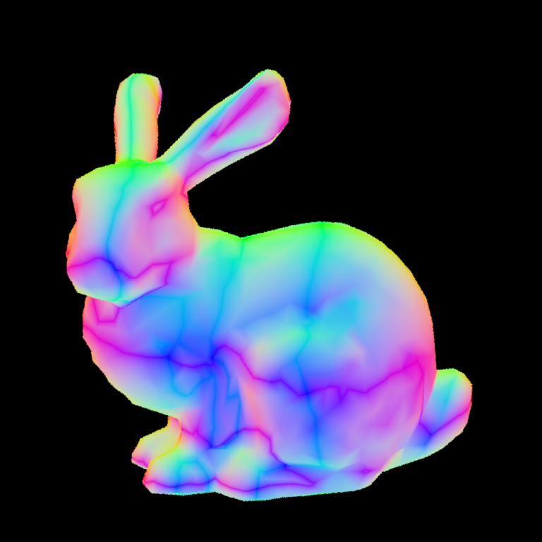

# RayTracing (Source https://github.com/wjakob/nori)

## Intro
> This project uses Surface Area Heuristic to determine whether splitting a bounding box or not and using KD-tree to store every bounding box

## Result
> Bunny (A small obj, which can be done under 150ms)

> Ajax (A large obj, which can be done under 7s)

